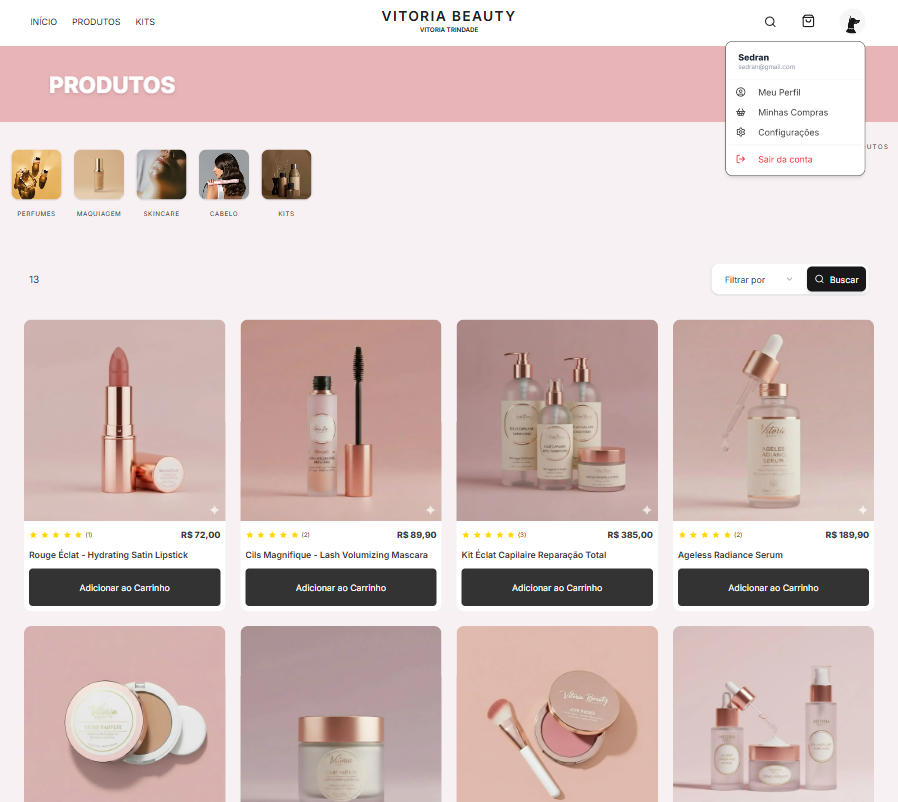

# 💄 Vitoria Beauty - E-commerce


<div align="center">
  
<br>
<br>
  O <strong>Vitoria Beauty</strong> é uma plataforma de e-commerce de cosméticos de alta performance, desenvolvida com o e mais moderno o ecossistema Fullstack, Next.js. O projeto foca em uma experiência de usuário fluida, com transições instantâneas, gerenciamento de estado inteligente e segurança.
</div>


Link: https://vitoria-beauty.vercel.app/

---

## 🚀 Tecnologias Utilizadas

### Core

- **Next.js (App Router):** Server Components, Server Actions e Suspense para performance máxima.
  
- **Node.js (Next.js):** JavaScript/TypeScript no backend
    
- **TypeScript:** Tipagem estática em toda a aplicação.
    
- **Prisma:** ORM para modelagem e consulta de dados.
    
- **Supabase:** Banco de dados PostgreSQL e Storage para persistência de imagens.
    

### Autenticação & Segurança

- **Next-Auth:** Gestão de sessões e autenticação.
    
- **Bcrypt:** Hash de senhas para segurança de dados sensíveis.
    
- **Middleware:** Proteção de rotas e controle de acesso em nível de borda.
    

### UI/UX

- **Tailwind CSS:** Estilização utilitária e responsiva.
    
- **Shadcn/UI:** Componentes de interface acessíveis e consistentes.
    
- **Lucide React:** Conjunto de ícones leves.
    
- **React** Renderização via JSX
    

---

## 🛠️ Funcionalidades Principais

### 🛒 Carrinho Inteligente (Hybrid Flow)

- **Offline First:** O carrinho é criado e gerenciado via cookies/local enquanto o usuário é anônimo.
    
- **Sincronização:** Ao realizar o login ou registro, os itens do carrinho offline são automaticamente vinculados ao `userId` no banco de dados, garantindo que o usuário não perca suas escolhas.
    

### 👤 Gestão de Perfil e Conta

- **Atualização de Identidade:** Troca de foto de perfil (via Supabase Storage), alteração de nome e atualização de senha com validação.
    
- **Endereços:** Sistema de múltiplos endereços com definição de endereço padrão.
    
- **Autocompletar via CEP:** Integração que preenche automaticamente cidade e estado ao digitar o CEP, otimizando o checkout.
    

### 🔍 Navegação e Performance

- **Filtros Avançados:** Filtragem por categorias e produtos integrada à URL (Search Params) para permitir compartilhamento e melhor SEO.
    
- **Streaming & Suspense:** Carregamento progressivo de componentes pesados para evitar bloqueio da interface.
    
- **Server Actions:** Tratamento de formulários e mutações de dados sem a necessidade de APIs REST tradicionais, reduzindo o bundle de JS no cliente.
    

---

## 📦 Como rodar o projeto

1. **Clone o repositório:**
    
    Bash
    
    ```
    git clone https://github.com/sedran18/vitoria_beauty.git
    ```
    
2. **Instale as dependências:**
    
    Bash
    
    ```
    npm install
    ```
    
3. **Configure as variáveis de ambiente (.env):**
    
    Snippet de código
    
    ```
    NEXT_PUBLIC_APP_NAME=
    NEXT_PUBLIC_APP_DESCRIPTION=
    NEXT_PUBLIC_DISCOUNT_IN_FIRST_PURCHASE=
    NEXT_PUBLIC_DISCOUNT_FOR_PIX=
    DATABASE_URL=
    DIRECT_URL
    AUTH_SECRET=
    NEXT_PUBLIC_SUPABASE_URL=
    SUPABASE_SERVICE_ROLE_KEY=
    ```
    
4. **Execute as migrações do banco e o Seed:**
    
    Bash
    
    ```
    npx prisma migrate dev
    npx prisma db seed
    ```
    
5. **Inicie o servidor de desenvolvimento:**
    
    Bash
    
    ```
    npm run dev
    ```
    

---

## 📐 Estrutura de Pastas (Destaques)

- `/app`: Rotas, páginas e layouts (Server Components).
    
- `/components`: Componentes de UI e componentes de cliente.
    
- `/lib`: Configurações, types, actions e utilitários.
    
- `/lib/actions`: Server Actions para manipulação de dados (Users, Cart, Addresses).
    
- `/app/(root)`: Rota principal, inclui o header e o footer no seu layout
